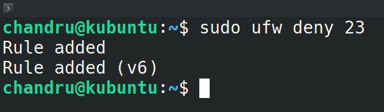
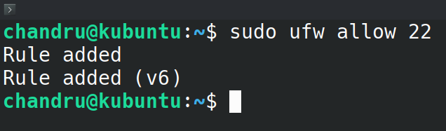
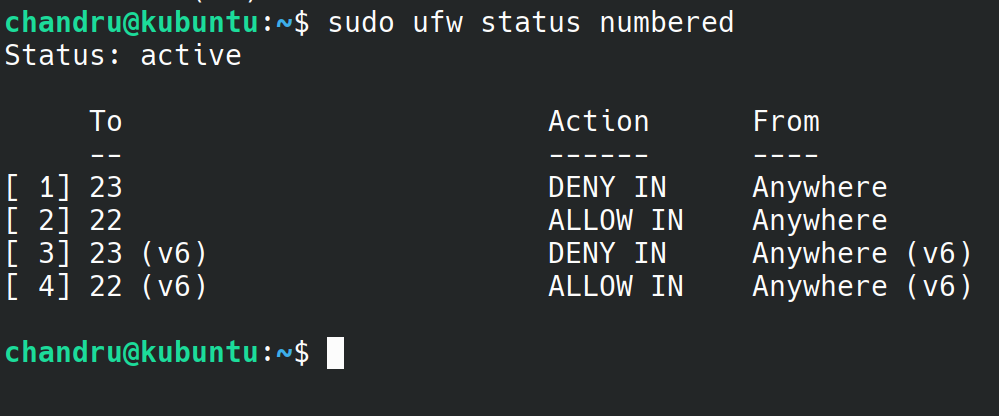
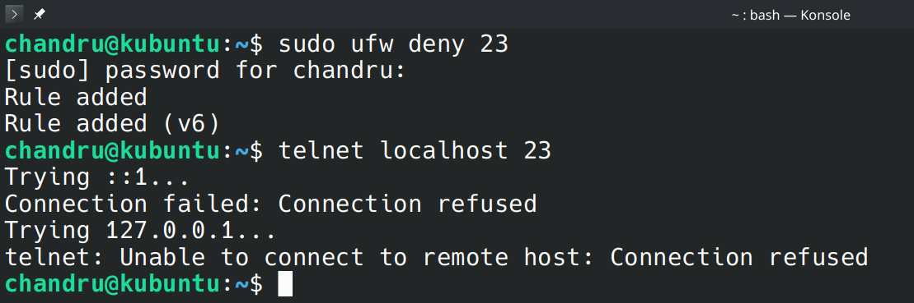
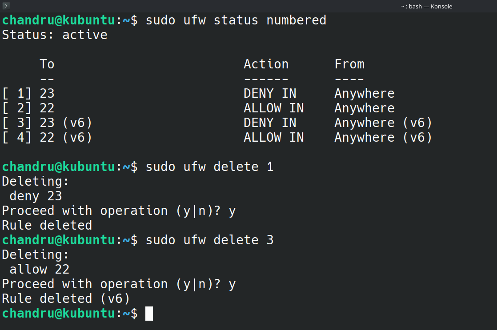
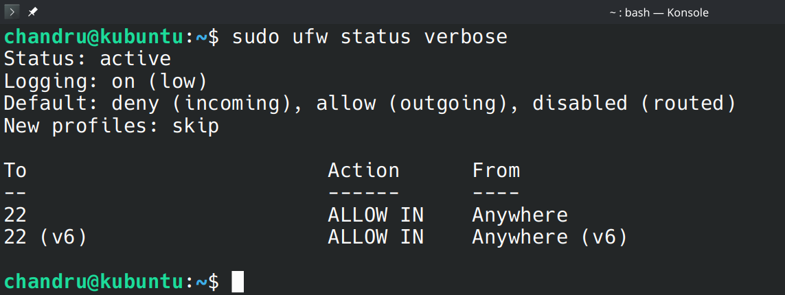

# 🔥 Day 4 – Firewall Configuration using UFW (Uncomplicated Firewall)

## 🎯 Objective
To configure and test basic firewall rules using **UFW** on **Kubuntu Linux**, demonstrating how to allow or block network traffic on specific ports for improved system security.

---

## 🖥️ System Details

- 🧑‍💻 **Operating System:** Kubuntu (Linux)
- 🔥 **Firewall Tool:** UFW (Uncomplicated Firewall)
- 🧪 **Testing Tool:** Telnet

---

## 🛠️ Step-by-Step Implementation

### 1️⃣ Check UFW Status

```bash
sudo ufw status
```
<br>

<br>

***🔍 Explanation:***
- Checks if the firewall is active and shows existing rules. UFW is often inactive by default.


### 2️⃣ Block Inbound Traffic on Port 23 (Telnet)
```bash
sudo ufw deny 23
```
<br>

<br>

***🔍 Explanation:***
- Blocks all incoming connections on port 23, used by Telnet—an outdated and insecure protocol. This helps reduce the system's attack surface.


### 3️⃣ Allow SSH (Port 22)
```bash
sudo ufw allow 22
```
<br>

<br>

***🔍 Explanation:***
- Ensures remote access via SSH remains available even after enabling UFW, avoiding accidental lockouts.


### 4️⃣ List Current Rules with Numbers
```bash
sudo ufw status numbered
```
<br>

<br>

***🔍 Explanation:***
- Displays rules in numbered order, allowing precise deletion or modification of individual rules.


### 5️⃣ Test the Deny Rule for Port 23 Using Telnet
```bash
telnet localhost 23
```
<br>

<br>

***🔍 Explanation:***
- Attempts to connect to the now-blocked Telnet port. A "Connection refused" result confirms that the firewall is working as expected.


### 6️⃣ Delete the Telnet Block Rule (Restore Original State)
```bash
sudo ufw delete <rule_number>
```
<br>

<br>

***🔍 Explanation:***
- Removes the rule added in Step 2 using the corresponding rule number from Step 4. Useful for testing environments.


### 7️⃣ Final Firewall Status (Verbose)
```bash
sudo ufw status verbose
```
<br>

<br>

***🔍 Explanation:***
- Provides a detailed overview of active rules, default policies, and logging status — ensuring transparency in firewall configuration.

<br><br>

## 📚 Summary of Concepts Learned

### 🔒 Firewall Fundamentals
- **UFW offers a beginner-friendly interface to manage iptables.**

### 🛡️ Traffic Filtering Logic
- **Inbound and outbound rule sets allow fine-grained control over network access.**

### 🚫 Why Block Telnet?
- **Telnet sends data unencrypted — making it unsafe in any secure system.**

### 🔐 Principle of Least Privilege
- **Opening only required ports enhances overall security posture.**


<br>

## ✅ Task Completed!
**All configurations and rules were applied, verified, and documented with appropriate screenshots. Firewall was restored to original state after testing.**

---

> "Security isn’t just a feature — it’s a mindset."
---
> — Chandraprakash C (chandruthehacker)

---


