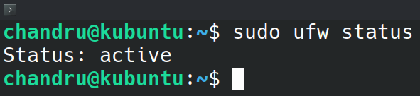

# 🔥 Day 4 – Firewall Configuration using UFW (Uncomplicated Firewall)

## 🎯 Objective
To configure and test basic firewall rules using **UFW** on **Kubuntu Linux**, demonstrating how to allow or block network traffic on specific ports.

---

## 🖥️ System Used
- OS: Kubuntu (Linux)
- Firewall: UFW (Uncomplicated Firewall)
- Testing Tool: Telnet

---

## 🛠️ Step-by-Step Implementation

### 1️⃣ Check UFW Status

```bash
sudo ufw status
```
<br>

<br>

***🔍 Explanation:***
- This command checks whether the firewall is active and displays current rules. Initially, UFW may be inactive on new installs.

